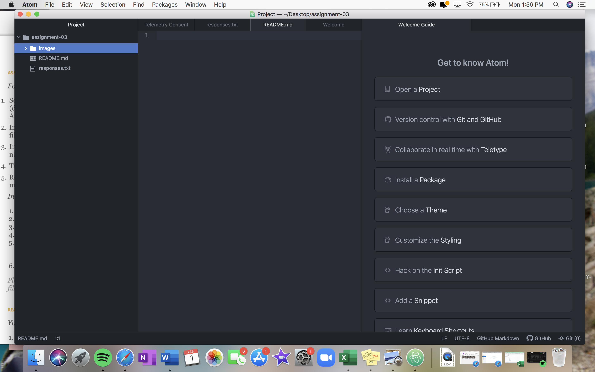

# Assignment 3 
## Kelsey Groff
1. I have learned the coding behind adding headings
2. I have gained a better understanding of what. different file types mean.
3. I am learning how to use GitHub and Atom because they are new softwares to me.

[Favorite Website](https://www.rei.com)

[My Responses](./responses.txt)

